# TextEditorPWA

## Description

Progresive web applications (PWAs, for short) allow users to enjoy high performing web applications that can be run offline and even installed on the user's local disk as if it were a native app for the given OS. This is done by using a combination of software technologies (packages) that bundle/compress client-side javascript files as well other assets(stylesheets, images, etc.) and create a production-ready distribution ("dist") folder from which the content will be served. Using service workers, in conjunction with the Cache API (not to be confused with standard http caching) and a so-called manifest file that stipulates how the app should run on different devices, we can create apps that adapt to pretty much any screen size, and retain much of their functionality offline or while dealing with slow or unstable Internet connections. Starting from some given code, we have created a text editor app that using a particular color-scheme serves to highlight JavaScript syntax. It can be used offline and be downloaded from its Heroku-deployed page (it really is a single page application). The code editor functionality and the overall styling were implemented by importing the corresponding CodeMirror minified js and css files from a Content Delivery Network. We import Inject Manifest from Google's 'workbox-webpack-plugin' in order to have more flexibility when selecting our caching strategies and creating our service worker. With respect to the caching, we register three different routes, creating a 'page-cache' with warmStrategy (so that caching starts during the installation life-event of the SW), an 'assets-cache' for static resources (including 'style', 'script', and 'worker' files), and an 'image-cache' for the different-sized icons and favicons generated by our manifest. Even though much of the code can be considered 'boilerplate', it was still something of a challenge to make it work due to sheer amount of modules, loaders, and plugins, as well as the multitude of options that need to be passed to the class constructors being imported. In  order to make our data resilient, in addition to the Caching API we make use of the localStorage and indexedDb APIs as well, so we can backup the user-entered input and provide a seamless experience no matter under what network conditions. We also got to use packages like 'concurrently' and 'if-env' to help us run the multiple scripts in our package.json files.

## Table of Contents

- [Installation](#installation)
- [Usage](#usage)
- [Credits](#credits)
- [License](#license)

## Installation

The application is available for online use as well as download from Heroku. However, for developers interested in understanding the code/tinkering wit it, the following local installation is a possibility:

1. Go to the CLI of Git BASH and use the "mkdir" command to create a new directory for the folder. Use the "cd" command to change directory.

2. Navigate to <https://github.com/jguemarez/TextEditorPWA>, press the "<> Code" button, choose the most convenient way to clone the repo, and copy it to the clipboard.

3. Go back to Git BASH and append the copied string to the command "git clone" .

4. Enter whathever means of authorization (e.g. a passphrase for SSH Keys) they ask you.

5. Within Git BASH, run "npm run install" to install the dependencies in the package.json files. That script will install dependencies both for development and production environments, both at the root level and at the level of the client and server folders.

6. Either run the command "npm run start:dev", meant for development, or "npm run start", meant for production mode.

8.Once a message indicating that a particular port is being used appears in the terminal, you can navigate to `http://localhost:${port}` to see the rendered app ready to use.

## Usage

Disclaimer: Screenshots present the website as rendered on the Google Chrome Version 116.0.5845.188 (Official Build) (64-bit), run in a Windows 11 Home Version 22H2 environment.

1.By navigating to the Heroku URL <https://a-better-text-editor-pwa-fefdee4d0ae6.herokuapp.com/>, the user will be presented with the following view:

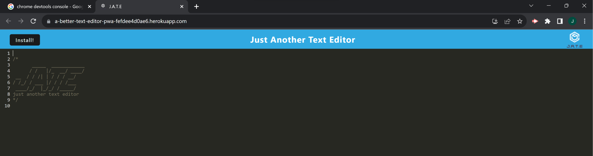
Note the install button as well as the download icon in the search bar for Google Chrome. The tab displays the title and the favicon with the logo for the app.

2.If we start typing into the code editor, we can see the JS syntax highlighting at work:

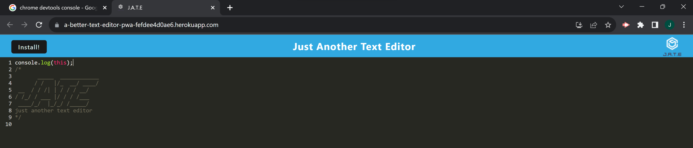

3.If we press the F12 key we can open the Chrome Dev Tools 'Console' and see the following logged messages:

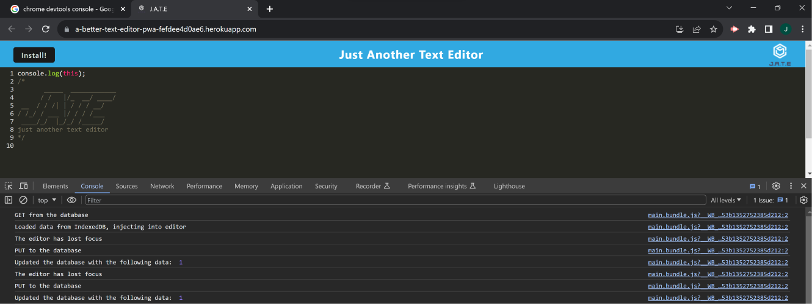

Note that the app automatically saves any changes on the editor when it loses focus (the 'blur' event).

4.Within the 'Application' menu we can see the Manifest data for the app:

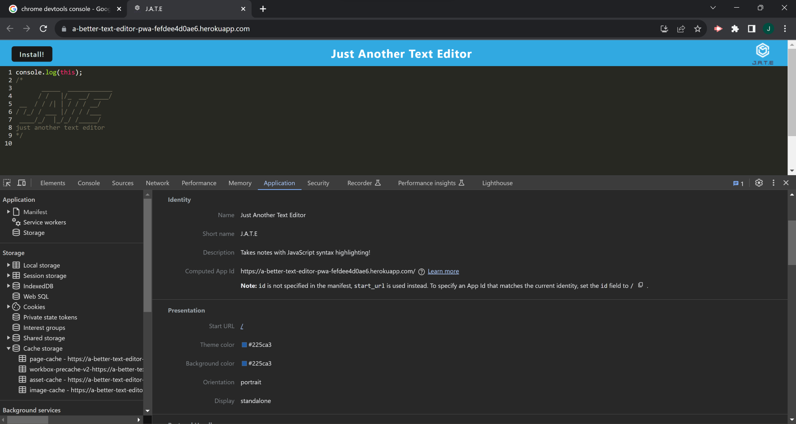

5.We can also see it has a registeres service worker(SW) that updates on reload:

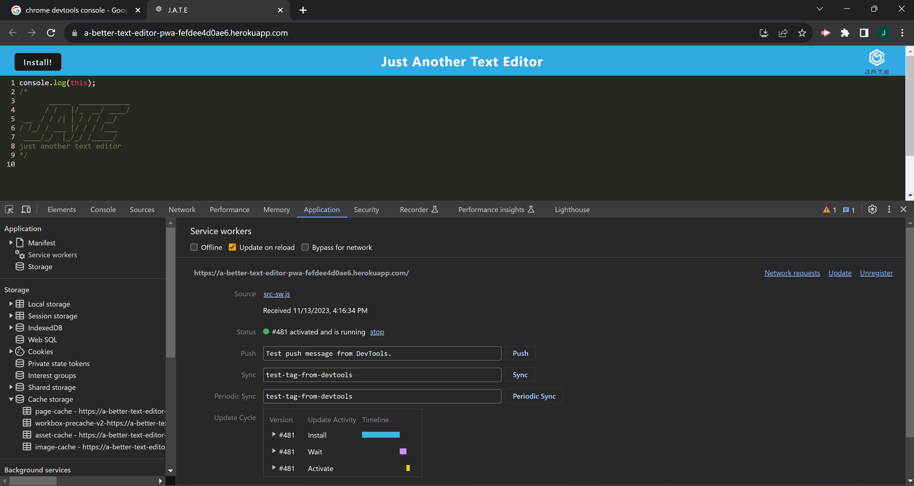

6.We can check how the data being input is stored using various client-side methods:

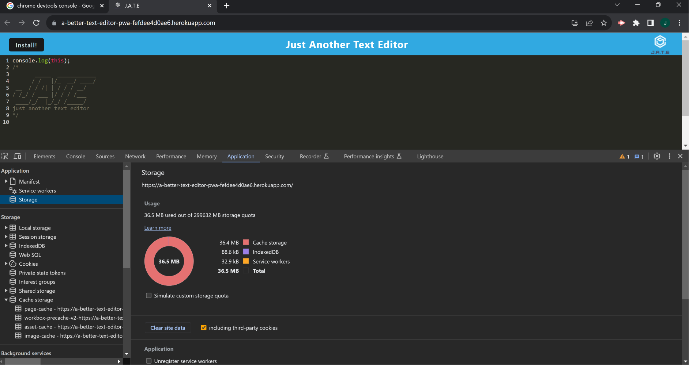

7.Content currently saved to localStorage:

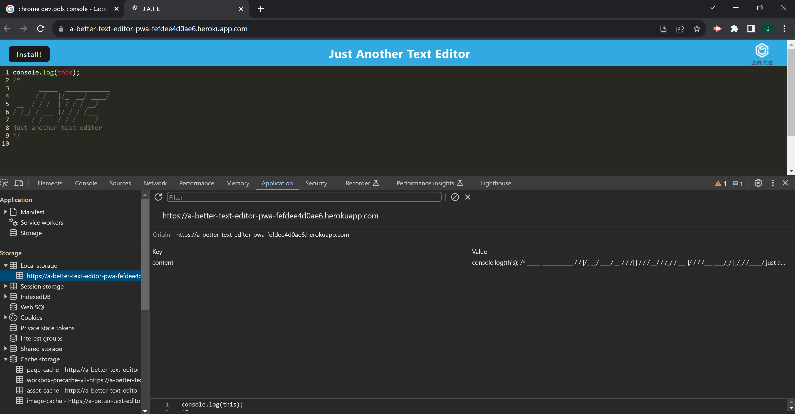

8.Content currently saved within the 'jate' object store of the 'jate' indexedDb database:

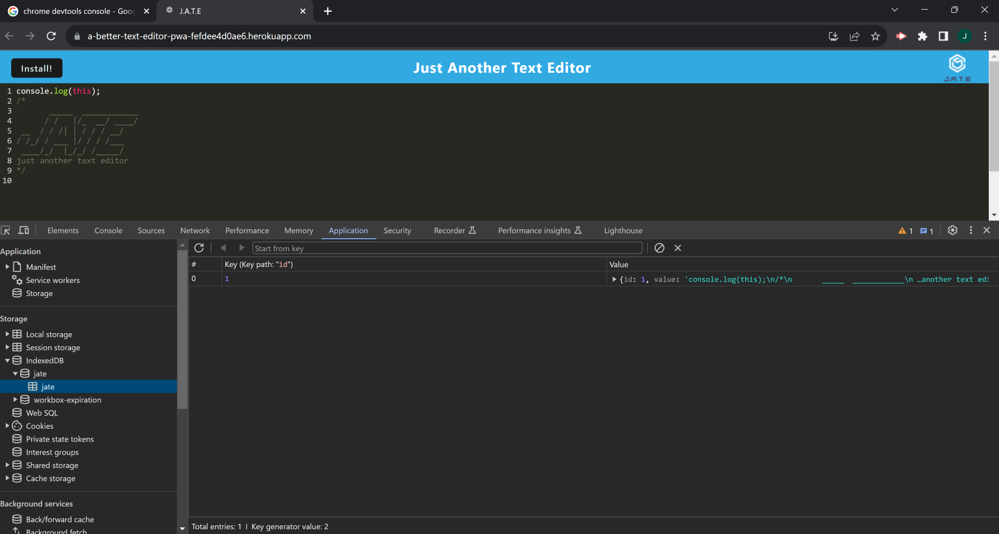

9.A 'workbox-expiration' database is also automatically generated:

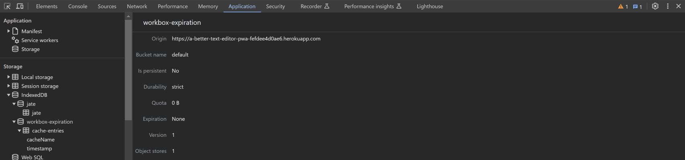

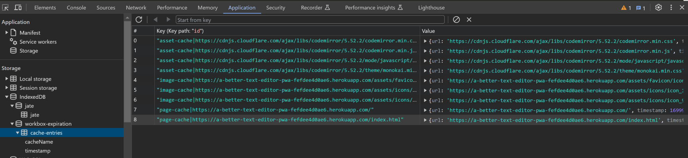

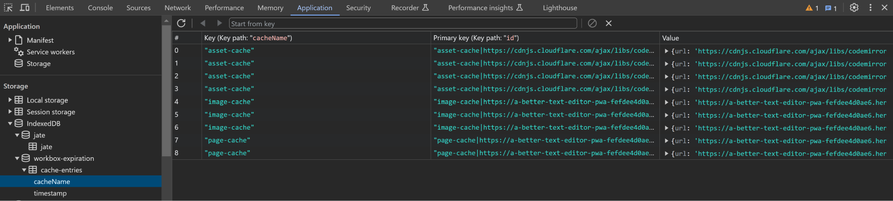

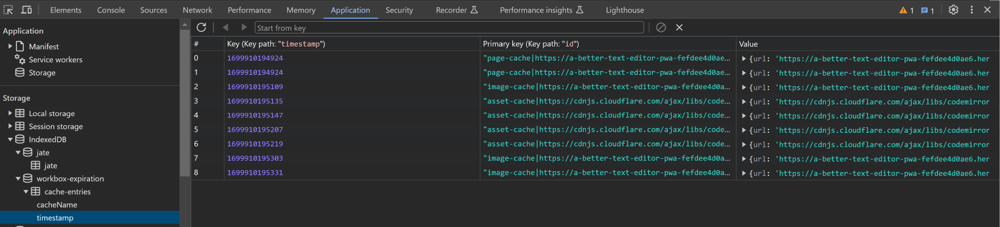

10.Within the 'Cache storage' we have:

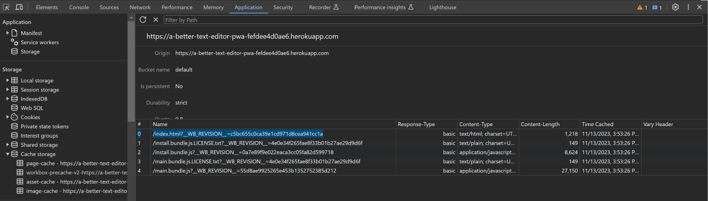

The 'workbox-precache-v2-*'.

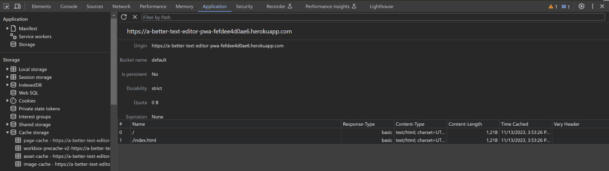

The 'page-cache' storage.

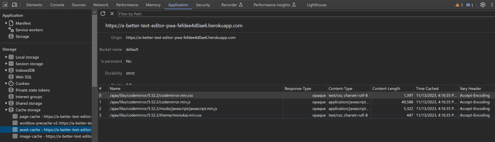

The 'asset-cache' storage.

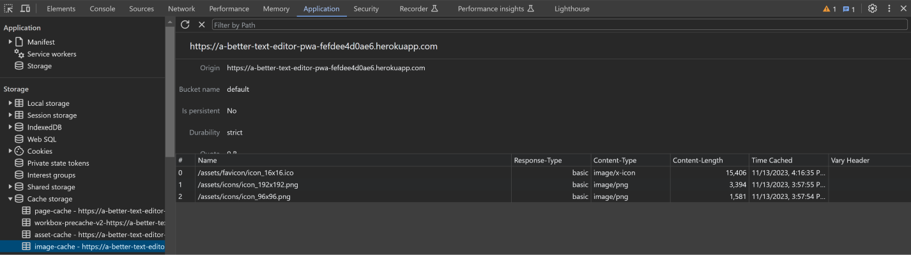

And finally, the 'image-cache' storage.

11.If we press the 'Install!' button, the following prompt appears:

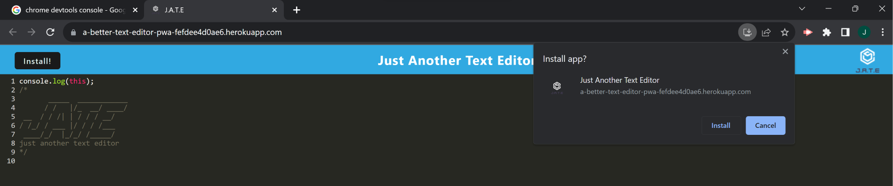

12.If we install the application, we get a more 'native-like' UI without a search bar:

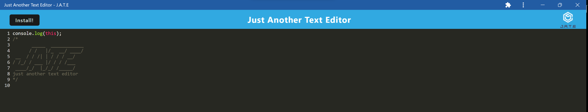

13.Then, the app's icon gets placed as a shortcut on the desktop display (it is also pinned to the taskbar):

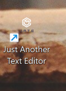

14.The app continues working offline (checkout 'No internet access' symbol in the lower right corner of the taskbar):

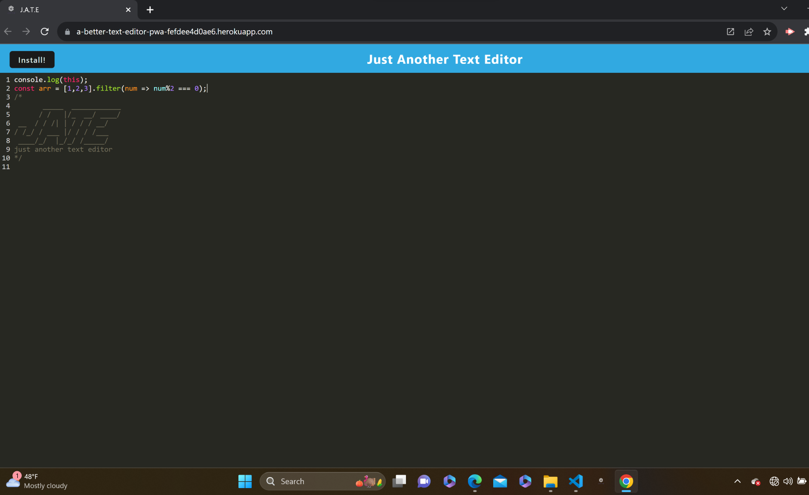

## Credits

This PWA was developed by Jonathan Maldonado Guemarez from starter code provided as part of the Rutgers Full-Stack Web Development Bootcamp.

The GitHub repo can be found at: <https://github.com/jguemarez/TextEditorPWA>.

The Heroku-deployed app can be found at: <https://a-better-text-editor-pwa-fefdee4d0ae6.herokuapp.com/>

The repo for the starter code by Xandromus can be found at: <https://github.com/coding-boot-camp/cautious-meme>

The .gitignore file was lifted from the GitLab class repo found at: <https://git.bootcampcontent.com>.

This app's scripts works both in the browser and in the Node.js JavaScript runtime environment. The latest stable (recommended version) for the latest can be found at: <https://nodejs.org/en/download>

We use npm for the specification (semantic versioning) of the app's dependencies and their installation. Here is the URL for the official site of the npm registry: <https://www.npmjs.com>
Here are the dependencies for the development and production environments that we added, including links to find their most recent versions:

Dev-dependencies:

1. Nodemon: "^2.0.3". Used to continuously track the changes to the .js and .json file while coding and debugging, so as not to have to manually stop and restart the Express server from listening at the designated port after each change.
<https://www.npmjs.com/package/nodemon>

2. Concurrently: "^5.2.0". Employed to run multiple commands concurrently and tell us whether any one of the processes fail, so we can debug more easily.
<https://www.npmjs.com/package/concurrently>

3. Babel-related packages: @babel/core": "^7.15.0",
    "@babel/plugin-proposal-object-rest-spread": "^7.20.7",
    "@babel/plugin-transform-runtime": "^7.15.0",
    "@babel/preset-env": "^7.15.0",
    "@babel/runtime": "^7.15.3",
    "babel-loader": "^8.2.2"

4. Css-loaders:"css-loader": "^6.2.0" & "style-loader": "^3.2.1"
   We use css-loader to help webpack collect CSS from all the css files referenced in the app and turn it to a string. Afterwards, style-loader would take the output string generated and insert it in a `<style>` HTML tags in the index.html file.
<https://www.npmjs.com/package/css-loader>
<https://www.npmjs.com/package/style-loader>

5. HtmlWebpackPlugin: "^5.3.2". It simplifies the creation of HTML files to serve webpack bundles.
<https://www.npmjs.com/package/html-webpack-plugin>

6. HttpServer: "^0.11.1".From the npm page: "a simple, zero-configuration command-line static HTTP server. It is powerful enough for production usage, but it's simple and hackable enough to be used for testing, local development and learning."
<https://www.npmjs.com/package/http-server>

7. WebPack-related dependencies: From <https://webpack.js.org>: "At its core, webpack is a static module bundler for modern JavaScript applications. When webpack processes your application, it internally builds a dependency graph from one or more entry points and then combines every module your project needs into one or more bundles, which are static assets to serve your content from."
    "webpack": "^5.51.1" <https://www.npmjs.com/package/webpack>
    "webpack-cli": "^4.8.0" <https://www.npmjs.com/package/webpack-cli>
    "webpack-dev-server": "^4.0.0" <https://www.npmjs.com/package/webpack-dev-server>
    "webpack-pwa-manifest": "^4.3.0" <https://www.npmjs.com/package/webpack-pwa-manifest>

8. Workbox: The main workbox package is "workbox-webpack-plugin": "^6.2.4". It gives different options to create service workers and implement pre-caching and caching strategies.
<https://www.npmjs.com/package/workbox-webpack-plugin>

Dependencies:
1.Express: "^4.17.1". In order to create and work with servers, middleware, routers, etc.
<https://www.npmjs.com/package/express>

2.If-Env: "^1.0.4". In order to simplify development and be able to run the correct scripts according to the node environment.
<https://www.npmjs.com/package/if-env>

3.code-mirror-themes: "^1.0.0". From this package we import the 'monokai' theme for the CodeMirror text editor embedded in our app.
<https://www.npmjs.com/package/code-mirror-themes>

4.idb: "^6.1.2". A lightweight package to facilitate use of the indexedDb API. From it we import the "OpenDB" method in order to create our database and its object store.
<https://www.npmjs.com/package/idb>

## How to Contribute

If you want to contribute, feel free to fork the repo, modify the repo on your local machine and then open a pull request. That way I can review the changes before deciding whether to merge them in the codebase or not.

## Tests

The app was extensively tested for bugs using Chrome Dev Tools, so that it was able to be deployed without problems to Heroku on the first try.
However, developers should keep an eye for any error thrown either in the Git Bash terminal and, if possible, open an issue in the GitHub repo detailing the bug. While serving the "dist" folder using localhost, fetch requests errors were frequent in early development, so watch out for those.

## Questions

The GitHub profile name of Jonathan Maldonado is "jguemarez" and you can checkout his profile at: <https://www.github.com/jguemarez>.
For further questions and comments, you can mail him to the following address: <cantor.dedekind112358@gmail.com>.

## License

This is an open-source project under the terms of agreement provided by the MIT license.
For more information, click on the following link: <https://opensource.org/license/mit>
